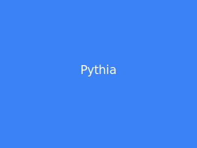

<p align="center">
  
</p>

# Pythia

**The quant desk for prediction markets. Built for everyone.**

Market intelligence and trading automation platform — Bloomberg Terminal meets Polymarket, built for retail traders and serious analysts who deserve quant-grade tools.

<p>
  <a href="https://pythia-quant.vercel.app"><strong>Live App →</strong></a>
  &nbsp;·&nbsp;
  <a href="https://johnw-n.com/projects/pythia"><strong>Case Study →</strong></a>
</p>

---

## Status

`In Development` — Core dashboard, analytics widgets, and Polymarket integration live. Bots and market making layers in progress.

---

## Why Pythia

Prediction markets hit **$63.5B in total volume** in 2025 (4x YoY growth) and crossed $13B in monthly volume. Institutional money is pouring in — ICE invested $2B in Polymarket, Kalshi raised at $11B. The analytics and intelligence layer remains severely underbuilt relative to traditional financial markets.

**The problem:** Retail traders on Polymarket, Kalshi, and emerging venues have no unified terminal. No signal heatmaps. No wash-trade filtering. No insider detection. No cross-venue arbitrage tools. No automation. They're trading blind compared to quant desks.

**Pythia solves this** with three layers:

1. **Analytics** — Signal heatmaps, trader intelligence, sentiment analysis, anomaly detection, cross-venue search
2. **Bots** — Arbitrage, momentum, alpha, copy trading — no-code builder for retail, code-accessible for power users
3. **Market Making** — Democratized liquidity provision with intelligent AMM curves and gamified rewards

---

## Core Features

### Analytics Layer (Live)

| Feature | Description |
|---|---|
| **Signal Heatmap** | Live market grid with color-coded signal states — momentum, liquidity, institutional activity |
| **Market Detail** | Price charts, order book depth, liquidity health, top traders, cross-venue price comparison |
| **Trader Profiles** | Pythia Trader Score (0-100), archetypes, win rate, Sharpe ratio, wash-trade flagging |
| **Trending Feed** | Real-time volume movers, momentum scores, new market radar |
| **Anomaly Detection** | Whale alerts, insider positioning radar, wash-trade detection, manipulation risk scoring |
| **Sentiment Engine** | NLP-driven market emotion tracking across Twitter, Reddit, news, Telegram |
| **Correlation Board** | Cross-market linkage explorer — find how markets move together |
| **Narrative Tracker** | Maps real-world news events to market price shifts |
| **Portfolio Overview** | Holdings across all venues, P/L tracking, exposure breakdown, hedging suggestions |
| **Event Calendar** | Market expiries, upcoming events, mention market schedules |

### Bots Layer (In Progress)

- **Arbitrage Bot** — Single-market and cross-platform price divergence
- **Momentum Bot** — Trend-following and contrarian strategies
- **Alpha Bot** — Pythia Score anomaly exploitation
- **News Reactor** — Event-driven trading on keyword triggers
- **Copy Trading** — Follow top traders with configurable scaling
- **Portfolio Manager** — Exposure rebalancing, drawdown guards, Kelly sizing

### Market Making Layer (Planned)

- Auto-MM pools with algorithmic capital distribution
- Dynamic spread management using analytics signals
- Gamified LP rewards and reputation system
- MM-as-a-Service API for prediction market platforms

---

## Venue Integrations

| Venue | Status | Notes |
|---|---|---|
| **Polymarket** | Live | CLOB + Gamma APIs, real-time data |
| **Kalshi** | Planned | REST API, CFTC-regulated |
| **Opinion Labs** | Planned | Continuous/distribution markets |
| **Limitless** | Planned | Base L2, high-frequency |
| **Myriad** | Planned | Multi-chain AMM model |

---

## Tech Stack

| Layer | Technology |
|---|---|
| **Framework** | Next.js 16 (App Router), TypeScript |
| **Styling** | Tailwind CSS (dark-mode only), Framer Motion |
| **State** | Zustand |
| **Charts** | TradingView Lightweight Charts, custom SVG |
| **Dashboard** | react-grid-layout (drag-and-drop, resizable widgets) |
| **Database** | PostgreSQL (Neon), Drizzle ORM |
| **Auth** | NextAuth.js, email OTP via Resend |
| **AI** | Anthropic Claude API |
| **Deploy** | Vercel |

---

## Design

> *The chain sees everything. The interface should surface what matters.*

Dark terminal aesthetic — black backgrounds with signal green (#00FF85) accents. Dense information architecture for traders who need signal, not noise. Every color carries meaning:

- **Green** — Positive signal, profit, bullish
- **Red** — Loss, bearish, warning
- **Amber** — Caution, thin liquidity
- **Blue** — Informational, institutional
- **Purple** — AI-generated, Pythia Score

Typography: IBM Plex Sans Condensed throughout. All market data uses monospace tabular numerals. Modular widget system — every panel is draggable, resizable, and pinnable.

**Design references:** [takeprofit.com](https://takeprofit.com/platform) (widget modularity), Bloomberg Terminal (information density), [verso.trading](https://verso.trading) (institutional interface).

<p align="center">
  
</p>

---

## Project Structure

```
pythia/
└── app/                          # Next.js application
    ├── src/
    │   ├── app/
    │   │   ├── dashboard/        # Main dashboard pages
    │   │   │   ├── page.tsx      # Widget grid home
    │   │   │   ├── trade/        # Trading interface
    │   │   │   ├── bots/         # Bot management
    │   │   │   ├── markets/      # Market browser + detail [id]
    │   │   │   ├── portfolio/    # Portfolio overview
    │   │   │   ├── alert/        # Alert configuration
    │   │   │   ├── earn/         # Market making / earn
    │   │   │   ├── venues/       # Venue integrations
    │   │   │   ├── calendar/     # Event calendar
    │   │   │   ├── search/       # Cross-venue search
    │   │   │   ├── settings/     # User settings
    │   │   │   └── traders/[id]  # Trader profiles
    │   │   ├── api/              # API routes
    │   │   │   ├── markets/      # Market data endpoints
    │   │   │   ├── auth/         # OTP auth flow
    │   │   │   ├── kalshi/       # Kalshi API proxy
    │   │   │   └── user/         # User data (bots, alerts, positions)
    │   │   ├── login/            # Auth pages
    │   │   └── verify/
    │   ├── components/
    │   │   ├── layout/           # Top nav, sub-header, sidebar
    │   │   ├── ui/               # Widget grid, widget panel, shared UI
    │   │   └── widgets/          # Individual dashboard widgets
    │   └── lib/
    │       ├── store.ts          # Zustand global state
    │       ├── widget-registry.ts # Widget definitions + default layouts
    │       ├── db/               # Drizzle schema + connection
    │       └── polymarket/       # Polymarket API client
    └── public/                   # Static assets
```

---

## Differentiation

| | Pythia | Verso | Stand.trade | Polymarket Analytics |
|---|---|---|---|---|
| Cross-venue aggregation | Yes (day one) | Kalshi-only | Limited | Polymarket-only |
| Wash-trade filtering | Default on | No | No | Partial |
| Insider detection | Yes | No | No | No |
| Bot automation | Full layer | No | Copy trading | No |
| Market making | Full layer | No | No | No |
| Trader profiles + scoring | Pythia Score | No | Basic | Yes |
| Social/follow system | Yes | No | Yes | No |
| Target user | Retail + institutional | Institutional | Power traders | Analysts |

---

## Roadmap

### Phase 1 — MVP (Current)
- [x] Design system + component library
- [x] App shell (nav, sidebar, command palette, widget grid)
- [x] Signal heatmap dashboard
- [x] Market detail page
- [x] Trader profiles + leaderboard
- [x] Trending + volume movers feed
- [x] Polymarket data integration
- [x] Anomaly feed (whale alerts, insider signals)
- [x] Alert system
- [x] Auth + portfolio
- [x] Mobile responsive layout
- [ ] Kalshi data integration
- [ ] Cross-venue search + arbitrage scanner
- [ ] Sentiment engine (NLP)

### Phase 2
- [ ] Opinion Labs integration
- [ ] Correlation board
- [ ] Narrative tracker
- [ ] Bot builder (arbitrage + copy trading)
- [ ] Pythia Score ML model

### Phase 3
- [ ] Bot marketplace
- [ ] Market making layer
- [ ] Institutional tier
- [ ] Mobile app
- [ ] Pythia API (data access)
- [ ] Token/reputation system

---

## Contact

**John Wright-Nyingifa** · Product Designer

[Portfolio](https://johnw-n.com) · [Twitter](https://twitter.com/I_triple9) · [Email](mailto:john.wnyingifa@gmail.com)
